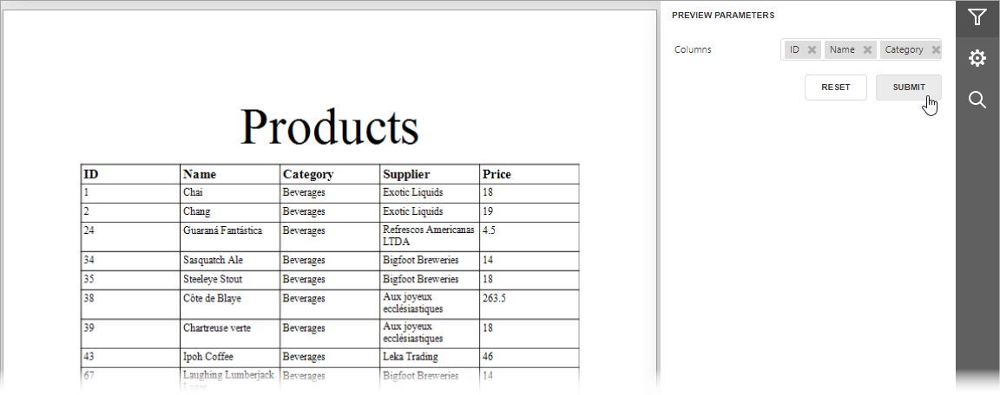

<!-- default badges list -->

<!-- default badges end -->
# Reporting - Use a Multi-Value Parameter as a Table Column Chooser

This example demonstrates how to generate table columns in a report dynamically based on submitted values of a multi-value parameter.

To create a table based on submitted parameter values, handle the [DataSourceDemanded](https://docs.devexpress.com/XtraReports/DevExpress.XtraReports.UI.XtraReportBase.DataSourceDemanded) event. Use a report's [Parameters](https://docs.devexpress.com/XtraReports/DevExpress.XtraReports.UI.XtraReport.Parameters) collection to access a parameter, and the parameter's [Value](https://docs.devexpress.com/CoreLibraries/DevExpress.XtraReports.Parameters.Parameter.Value) property to get selected parameter values. Use [XRTable](https://docs.devexpress.com/XtraReports/DevExpress.XtraReports.UI.XRTable) control methods and properties to create or modify a table.

In this example, parameter values are initialized in code. A [LookUpValueCollection](https://docs.devexpress.com/CoreLibraries/DevExpress.XtraReports.Parameters.LookUpValueCollection) object is used to store table column names and captions.

## Files to Look At

- [SampleReport.cs](./CS/T333639/SampleReport.cs#L10) ([SampleReport.vb](./VB/T333639/SampleReport.vb#L10))

## Documentation

- [Create a Table Report with Dynamic Columns](https://docs.devexpress.com/XtraReports/401853)
- [XRTable Class](https://docs.devexpress.com/XtraReports/DevExpress.XtraReports.UI.XRTable)
- [Multi-Value Report Parameters](https://docs.devexpress.com/XtraReports/9998)

<!-- feedback -->
## Does this example address your development requirements/objectives?

 

(you will be redirected to DevExpress.com to submit your response)
<!-- feedback end -->
